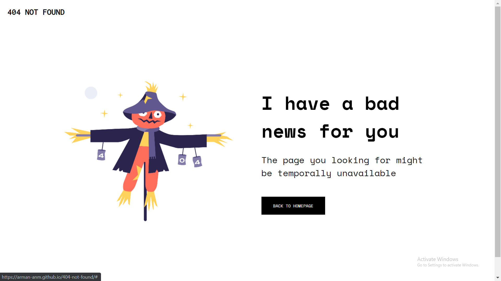

<h1 align="center">Solution to '404 Page Challenge' using Flexbox</h1>

   Solution for a challenge from  <a href="http://devchallenges.io" target="_blank">Devchallenges.io</a>.

  <h3>
    <a href="https://arman-anm.github.io/404-not-found">
      Demo
    </a>
     | 
    <a href="https://github.com/arman-anm/404-not-found">
      Solution
    </a>
     | 
    <a href="https://devchallenges.io/challenges/wBunSb7FPrIepJZAg0sY">
      Challenge
    </a>
  </h3>

## Table of Contents

- [Table of Contents](#table-of-contents)
- [Overview](#overview)
  - [Built With](#built-with)
- [Features](#features)
- [Contact](#contact)

## Overview

### Built With

- Semantic HTML
- CSS Custom Properties
- Flexbox

## Features

This simple site was created as a challenge offered by [DevChallenges](https://devchallenges.io/challenges). The [challenge](https://devchallenges.io/challenges/wBunSb7FPrIepJZAg0sY) was to build a responsive webpage following the given design.

## Contact

- GitHub [@arman-anm](https://github.com/arman-anm)
- Twitter [@arman_anm](https://twitter.com/arman_anm)
